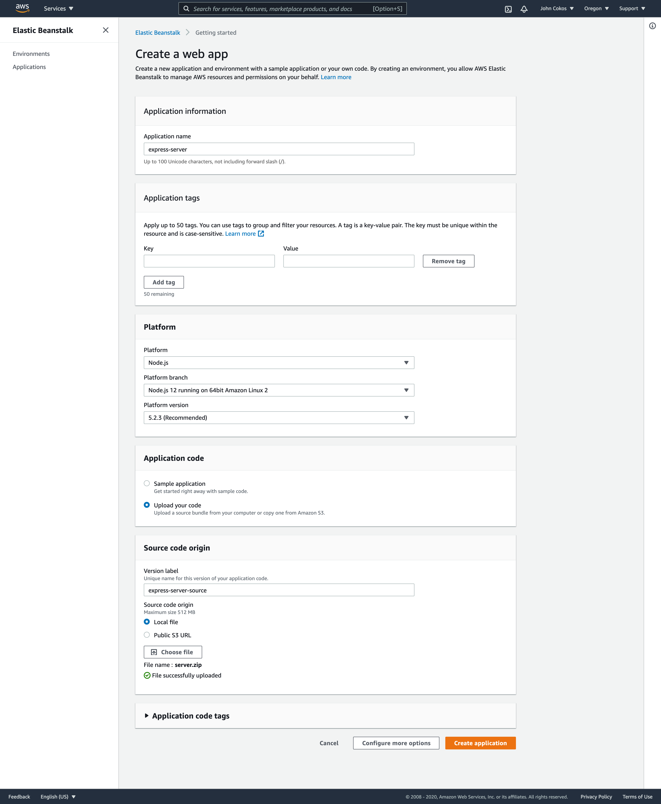
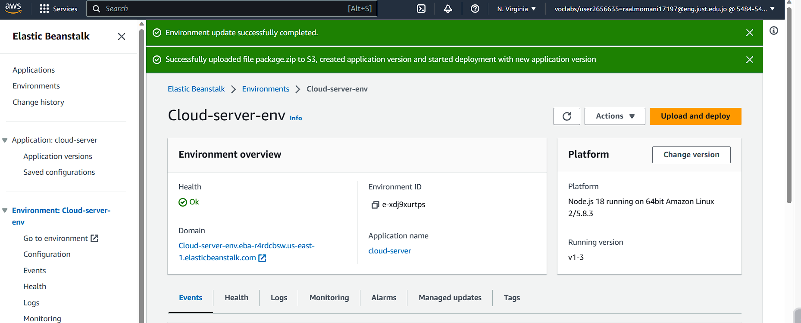

# Deploy a simple Node.js server to EC2, using Elastic Beanstalk

----

### Description:

>This is a basic Express.js application written in JavaScript. It has two routes: home route ("/") and the "/api" route. The home route returns a JSON message saying "Welcome To Home Page!!", while the "/api" route returns a JSON message saying "Welcome To Api Page!!". The app listens on port 4000 and logs a message when it starts successfully.

----

**Deployment process on aws Elastic Beanstalk:**

1. Click on "Create Application" and provide a name and optional description for your application.
2. Within your application dashboard, click on "Create environment."
Select the web server environment type.
3. Choose a preconfigured platform based on your Node.js version.
4. Provide an environment name and optional description.
5. Select the appropriate instance type and other configuration options.
Click on "Create environment" to start creating the environment.
6. Zip your application including the package.json 
7. Submit to deploy your application, Elastic Beanstalk will automatically create a new application version, deploy it.

----

 Deployed server link: http://cloud-server-env.eba-r4rdcbsw.us-east-1.elasticbeanstalk.com/

